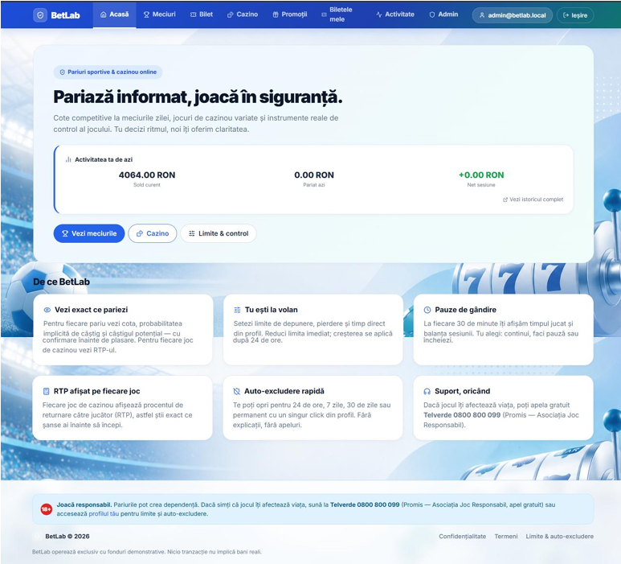
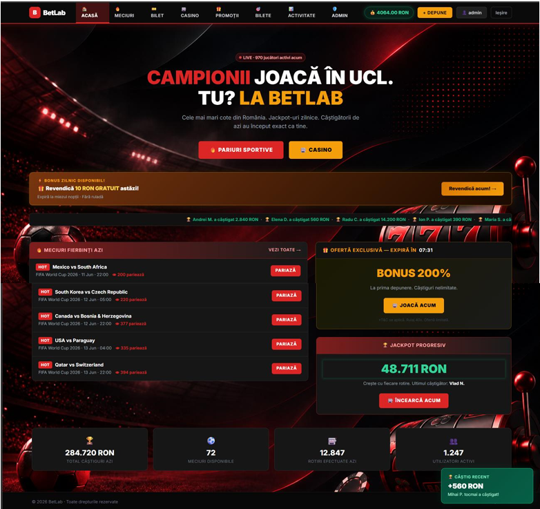
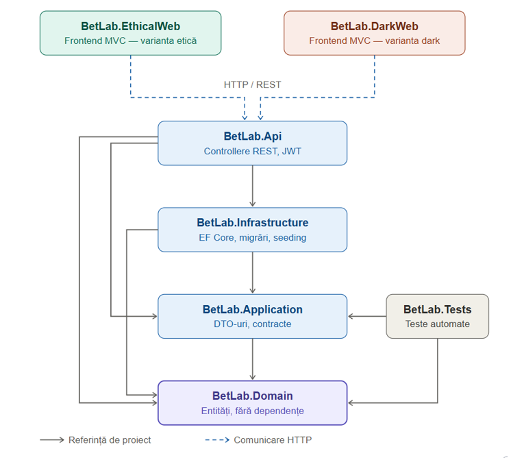

# BetLab

**A sports betting and casino platform built in two interface variants over a single shared backend — and a study measuring how much the interface alone changes user behaviour.**

Both versions run on the same API, the same business logic and the same database. One follows responsible design principles: implied win probability on every odd, RTP on every game, a confirmation summary before each bet, real deposit and loss limits. The other reproduces persuasive mechanisms found on commercial gambling sites: near-miss outcomes, auto-spin, expiring bonuses, a live feed of other people winning.

Since everything below the interface is identical, any behavioural difference between them comes from design.

| Ethical variant | Dark variant |
|---|---|
|  |  |

---

## Stack

- **Backend** — C#, .NET 8, ASP.NET Core Web API, Entity Framework Core 8, Npgsql, ASP.NET Core Identity, JWT, Swagger
- **Frontend** — ASP.NET Core MVC, Razor, JavaScript, Bootstrap
- **Database** — PostgreSQL, EF Core migrations and seeding
- **Cloud** — Azure App Service, Neon (serverless PostgreSQL)
- **Analysis** — Python, pandas, NumPy, SciPy, scikit-learn, matplotlib

---

## Architecture



Clean Architecture across seven projects, dependencies pointing inward toward a technology-agnostic domain of 21 entities.

| Project | Responsibility |
|---|---|
| `BetLab.Domain` | Domain entities, no external dependencies |
| `BetLab.Application` | DTOs and application contracts |
| `BetLab.Infrastructure` | EF Core context, configuration, migrations, seeding |
| `BetLab.Api` | REST controllers, JWT authentication |
| `BetLab.EthicalWeb` / `BetLab.DarkWeb` | Two MVC frontends consuming the same API |
| `BetLab.Tests` | Automated tests |

Isolating business logic from presentation is what makes the comparison valid: the interface is the only variable.

**Platform features** — single and combined bet slips (total odds as the product of selections), live odds imported from an external football API, cash-out, and three casino games: slots, roulette and blackjack. Casino outcomes are generated server-side so they cannot be manipulated by the client. Every wallet operation writes a transaction recording the balance before and after.

---

## The two variants

For every manipulative mechanism there is a deliberate counterpart.

| Dark | Ethical |
|---|---|
| Odds shown alone | Odds with implied win probability |
| No RTP information | RTP displayed per game, with an explanation |
| One-tap bet placement | Confirmation summary: stake, total odds, potential win, combined probability |
| Near-miss outcomes highlighted | — |
| Auto-spin: many rounds from one action | Manual spin only |
| Expiring bonuses, free spins, daily promo wheel | No urgency or variable-reward mechanics |
| Live "winners" feed, active-player counter | No social proof elements |
| No player controls | Deposit, loss and time limits — reductions apply immediately, increases only after 24 hours |
| No session feedback | Periodic reality checks showing session duration and balance |
| — | Self-exclusion, plus a responsible-gambling helpline in every page footer |

---

## Interaction logging

A custom logging system turns the platform into a measurement instrument. Every relevant interaction becomes an `InteractionLog` holding the session and user, the interface variant, event type, page, target element, previous and new values, a free-form JSON metadata field and a timestamp. The metadata field carries event-specific data — stake and odds on a bet, for example — without schema changes.

```
POST /api/logging/session-start   → opens a session, returns its id
POST /api/logging/event           → records one event, validating the session
POST /api/logging/session-end     → closes the session
```

---

## Results

40 participants used **both** variants across two weeks in a crossover design, each acting as their own control. Analysis in Python used non-parametric tests (Mann–Whitney U, Wilcoxon signed-rank), Cliff's delta with bootstrap confidence intervals, and correction for multiple testing.

| Median per user | Dark | Ethical | p | Cliff's δ |
|---|---|---|---|---|
| Total events | 352.5 | 93.5 | 0.0013 | 0.60 |
| Core gambling actions | 264.5 | 51 | 0.0006 | 0.64 |
| Casino actions | 163.5 | 16.5 | 0.0005 | 0.64 |
| Betting actions | 65.5 | 26.5 | 0.0149 | 0.45 |
| Time to first wager | 35 s | 63 s | 0.00016 | — |

Roughly **5× more gambling actions** on the manipulative interface, with the first bet placed almost twice as fast. Near-miss exposure correlated strongly with total casino activity (Spearman r = 0.94), and 45% of all spins in the dark variant came from auto-spin — rounds started without a per-round decision.

On the ethical side the confirmation dialog worked as a real exit: **48% of participants cancelled at least one bet** after seeing the summary, and 38% configured limits.

All generated charts and result tables are in [`analysis/outputs/`](analysis/outputs/).

---

## Running locally

Requires .NET 8 SDK and PostgreSQL 14+.

```bash
cd app
dotnet restore
dotnet ef database update --project BetLab.Infrastructure --startup-project BetLab.Api
dotnet run --project BetLab.Api
dotnet run --project BetLab.EthicalWeb    # or BetLab.DarkWeb
```

`appsettings.json` contains local development defaults only; real credentials belong in `appsettings.Development.json` or environment variables. The database seeds itself with sports, competitions, events and casino games.

Analysis pipeline:

```bash
cd analysis
python -m venv .venv && source .venv/bin/activate    # Windows: .venv\Scripts\activate
pip install -r requirements.txt
python src/run_all.py
```

---

## Note

The manipulative variant exists to measure harm, not to demonstrate how to cause it — it reproduces mechanisms already deployed commercially, in a controlled environment, to quantify their effect and show that the ethical counterparts are implementable.

This is not a real gambling platform: virtual balances only, no payment integration, no connection to any operator. The study involved no real money.
